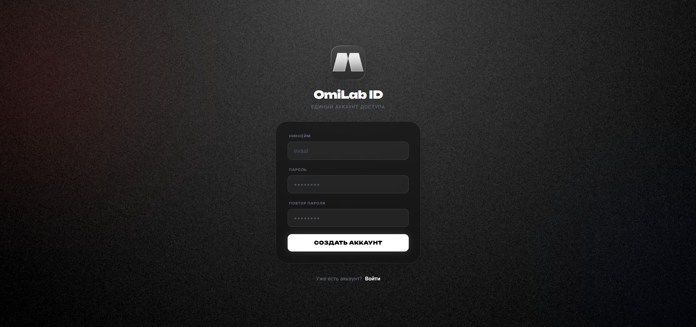

<div align="center">
  <a href="https://github.com/evaal/omilab">
    
  </a>

  <h1 align="center">OmiLab</h1>

  <p align="center">
    <b>Next-Gen платформа для управления университетскими знаниями</b>
    <br />
    <a href="#-демо">Посмотреть демо</a>
    ·
    <a href="#-фичи">Фичи</a>
    ·
    <a href="#-запуск">Запуск</a>
  </p>
  
  
  
  
  
</div>

<br />

## ⚡ О проекте

**OmiLab** - это современная платформа для студентов и преподавателей, объединяющая красоту интерфейса и мощь автоматизации. Мы ушли от скучных Word-файлов к интерактивным веб-лекциям с возможностью автоматической генерации PDF.

> *"Знания не должны оставаться за дверями университета."*

## 📸 Демо

<div align="center">
  
</div>

## 🚀 Фичи

### 📝 Гибридная система контента
* **WYSWYG Редактор:** Пиши лекции прямо в браузере с красивым форматированием.
* **Smart Upload:** Есть готовый файл? Просто загрузи PDF, и плеер встроит её на страницу.

### ⚙️ Авто-генерация документов (PDF Service)
Если ты пишешь текст вручную, OmiLab **автоматически верстает** из него профессиональный PDF-документ:
* Титульная страница с логотипом университета.
* Водяные знаки с именем автора (защита авторства).
* Автоматическая нумерация страниц и колонтитулы.

### 💎 Tier-1 UI/UX
* Полная **Dark Theme** (Glassmorphism).
* Встроенный PDF-вьюер с зумом.
* Адаптивность под мобильные устройства.

## 🛠 Технический стек

Этот проект построен на современном и быстром стеке технологий:

| Компонент | Технология | Описание |
| :--- | :--- | :--- |
| **Backend** | `FastAPI` | Асинхронный, быстрый REST API |
| **Database** | `SQLite` + `SQLAlchemy` | Надежное хранение данных с ORM |
| **Frontend** | `Jinja2` + `TailwindCSS` | SSR рендеринг с современными стилями |
| **PDF Engine** | `fpdf2` | Кастомный генератор документов |
| **Migrations** | `Alembic` | Управление версиями базы данных |

## 🏗 Архитектура

```mermaid
graph LR
    A[Client / Browser] -- HTTP Request --> B(FastAPI Router)
    B -- Validation --> C{Logic / Services}
    C -- PDF Gen --> D[PDF Service]
    C -- CRUD --> E[(SQLite DB)]
    D --> F[Static Files]
    E --> B
    F --> B
    B -- HTML Response --> A